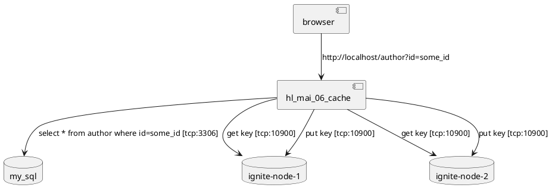

## Пример по курсу Архитектура Программных систем

Запускаем в docker-compose кластер Apache Ignite:

- для архитектуры x86 используем образ apacheignite/ignite
- для архитектуры arm applem1support/ignite:2.12.0

Тестовый запрос для добавления в MySQL и кэш:

http://172.16.191.128/author?add&first_name=*Vasia*&last_name=*P**upkin*&title=*Mr*&email=*vasia@pupkin.com*

Тестовый запрос для поиска в кэше:

http://*localhost*/author?id=*some_id -* поиск записей (шаблон сквозное-чтение)
